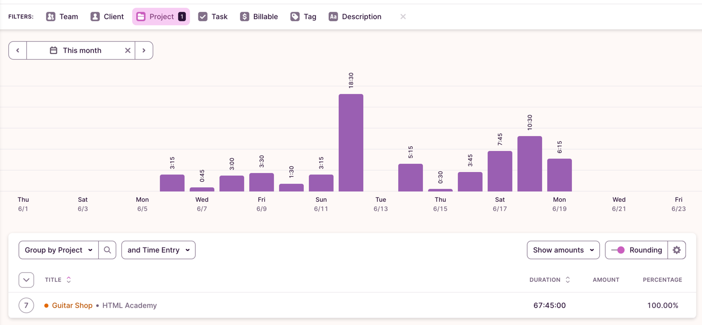

# Guitar-Shop
### Work in progress!!! 

The graduation project after completion of the "Full Stack Developer Profession" course at HTMLAcademy.

 Student: [Dmitriy Kozlov](https://up.htmlacademy.ru/nodejs-api/3/user/912453).
 GitHub repo: [Guitar-Shop](https://github.com/MrDimk/Guitar-Shop)

## Remaining Tasks

The project is not fully completed, and the following tasks are still pending:

- Not all scenarios are implemented on the frontend (loading data from the server with filters, sorting, and pagination).
- There are issues with adding the token to each request.
- Other issues...

Please note that the project is a work in progress, and these tasks need to be addressed to achieve full functionality.

## Project Setup Guide

The Guitar-shop project, an administrative section of a guitar store website, is divided into two folders: frontend and backend. To run the project, follow these steps:

### 1. Install Dependencies

Navigate to the `backend` folder and run the following command:

`npm install`

Then, go to the `frontend` folder and run the same command.

### 2. Configure Environment Variables

Create a `.env` file in the `backend` folder based on the `.env-example` file, and fill in the required environment variables.

### 3. Run Docker Containers

Make sure Docker is installed on your system. Then, run the following command:
`docker-compose up`

This will start the Docker containers with the settings specified in the `docker-compose.yml` file.

### 4. Populate the Database

Once the database is up and ready, you can populate it with initial data using a CLI application with a mock guitar store data generator.

### 5. Start the Server and Client

In the `backend` folder, run the command: `npm run start:dev`

Then, in a separate terminal, navigate to the `frontend` folder and run the command:
`npm start`

Now, the server and client will be running, and you can access the project in your browser at `http://localhost:${PORT}`.

The project setup is complete. You can now start working with the administrative section of the guitar store website.

## Time Tracking

Time tracking was done using the Toggle service, which was a new experience for me, so the tracking may not be entirely precise. The total time spent on the project was approximately 60 hours.

The distribution of time was more focused on weekends due to my primary full-time work commitments.

